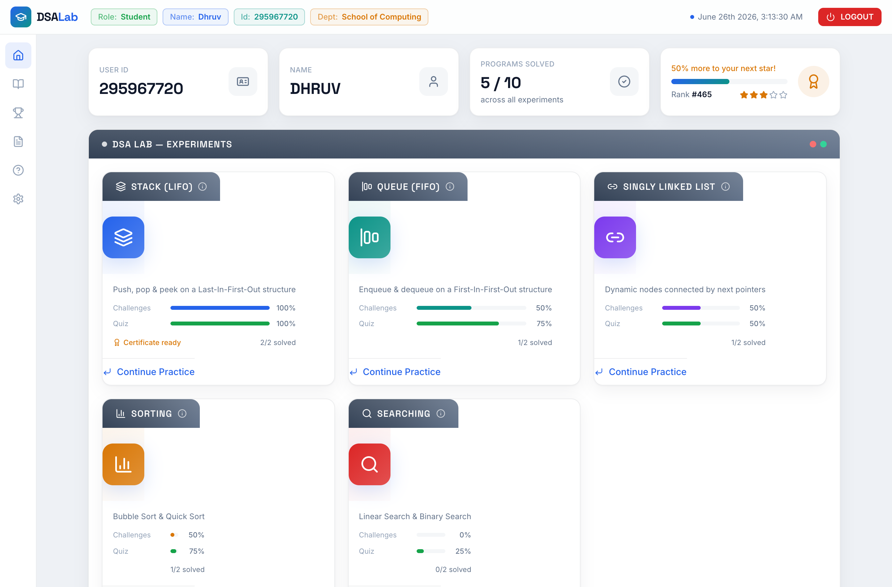
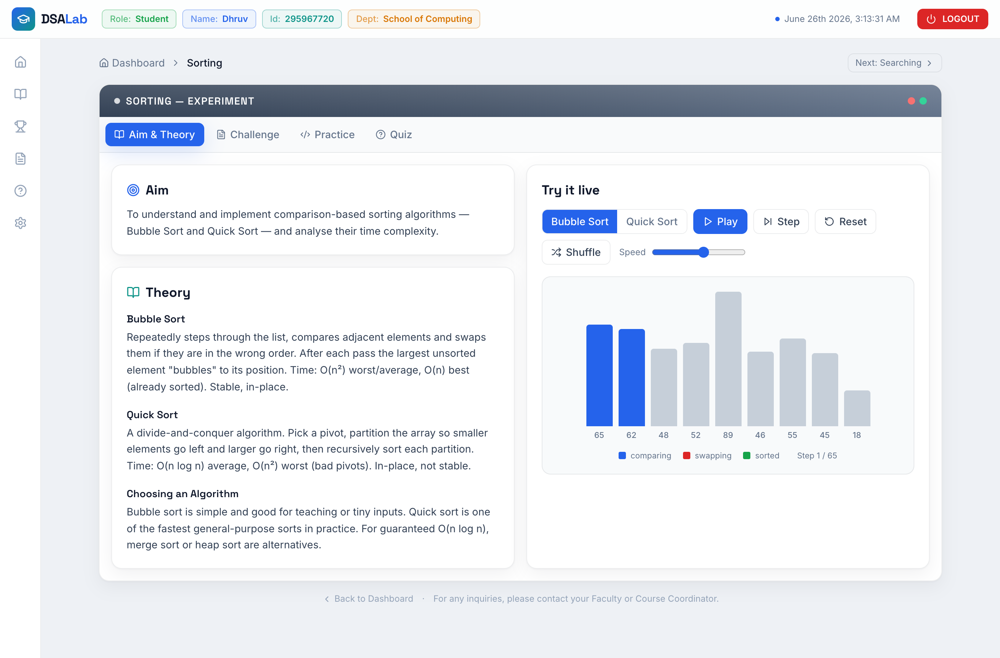
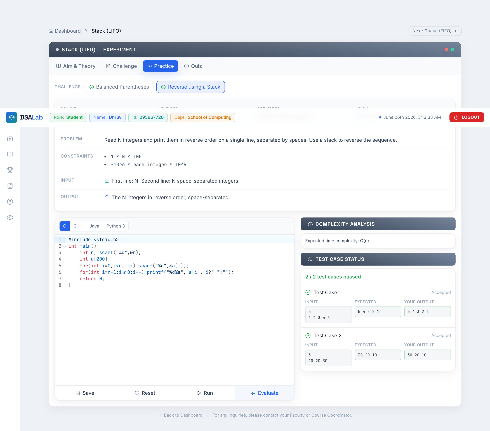
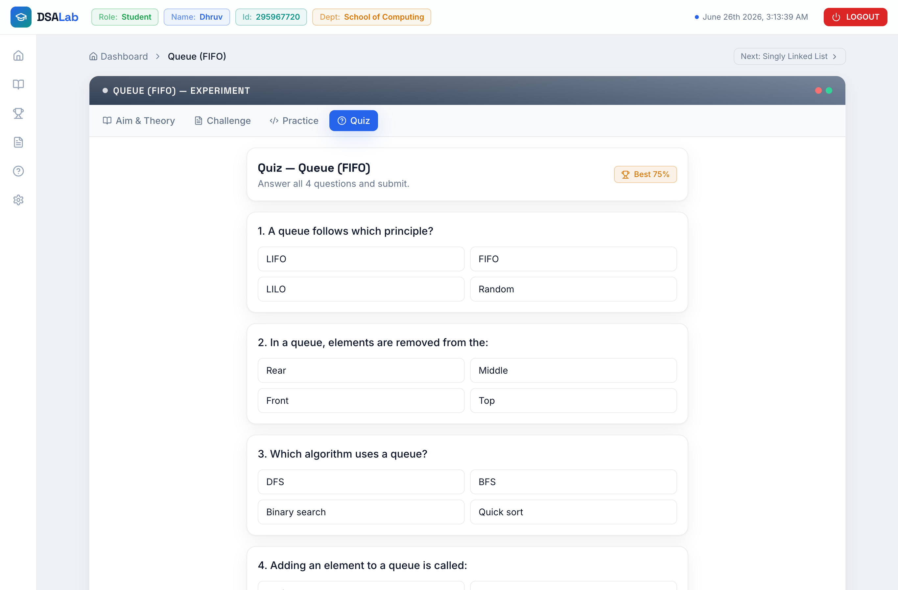

<h1 align="center">🧪 DSA Virtual Lab</h1>

<p align="center">
  An interactive <b>Data Structures &amp; Algorithms</b> learning platform — theory,
  animated visualizations, a real in-browser code editor, and quizzes.
</p>

<p align="center">
  <a href="https://dsa-virtual-lab.vercel.app"></a>
</p>

<p align="center">
  
  
  
  
  
  
</p>

<p align="center">
  
</p>

A full-fledged virtual lab modeled on the SRMIST *eLab* experience. Each experiment
combines **theory**, an **interactive visualization**, a **real code editor** (compile &
run against test cases), and a **quiz**. Built with **React + Vite + TailwindCSS**, using
the GradeX typographic design language (Space Grotesk / Inter / JetBrains Mono) recoloured
to an academic light palette.

🔗 **Live:** https://dsa-virtual-lab.vercel.app

## Screenshots

| Experiment — theory & live visualizer | Practice — real C/C++/Java/Python grading |
|:--:|:--:|
|  |  |
| **Animated data-structure simulations** | **Quiz with instant scoring** |
|  |  |

## The 5 experiments
1. **Stack (LIFO)** — push / pop / peek; balanced parentheses, reverse using a stack
2. **Queue (FIFO)** — enqueue / dequeue; FIFO ordering, rotate the queue
3. **Singly Linked List** — build & traverse, delete a value
4. **Sorting** — Bubble Sort & Quick Sort (animated bars, step/play/speed)
5. **Searching** — Linear & Binary Search (animated lo/hi/mid)

Each experiment page has four tabs: **Aim & Theory · Challenge · Practice · Quiz**.

## Getting started
```bash
npm install
npm run dev      # http://localhost:5174
npm run build    # production build → dist/
npm run preview  # serve the production build
```

## Real code execution (free, no setup)
The editor compiles & runs **C / C++ / Java / Python** for real — no API key, no server.

The browser posts to a same-origin proxy (`/api/execute`) which runs submissions on the
free public **Wandbox** compiler API. This works out of the box both on Vercel and in
`npm run dev` (a small Vite middleware mirrors the serverless function locally). The
`Evaluate` button grades your code against the test cases.

- Set `VITE_EXEC_MODE=mock` to turn execution off (editor becomes reference-only).
- See **DEPLOY.md** to swap the backend to your **self-hosted Judge0** for unlimited,
  private execution — just set `JUDGE0_URL` as a server env var; no code changes.

## Progress
Login is a demo (no password) and your **profile, solved challenges and quiz scores**
are stored in `localStorage` on the device — they drive the dashboard progress bars,
"Programs Solved" count and rank.

## Deploy (free)
Static SPA — deploy `dist/` to **Vercel** or **Netlify**. SPA deep-link routing is
preconfigured (`vercel.json` and `public/_redirects`).

## Project layout
```
src/
  pages/        Login, Dashboard, Experiment
  components/
    layout/     TopBar, SideBar, SectionHeader, AppShell  (eLab chrome)
    dashboard/  StatCard, ExperimentCard, RankWidget
    experiment/ ChallengeInfo, TestCasePanel, PracticePanel, ResultPanel, TheoryPanel
    editor/     CodeEditor (CodeMirror 6)
    visualizers/ Stack, Queue, LinkedList, Sort, Search
    quiz/       Quiz
  lib/          progress.js (localStorage), judge0.js (execution + mock fallback)
  data/         experiments.js  (single source of truth for all content)
```
